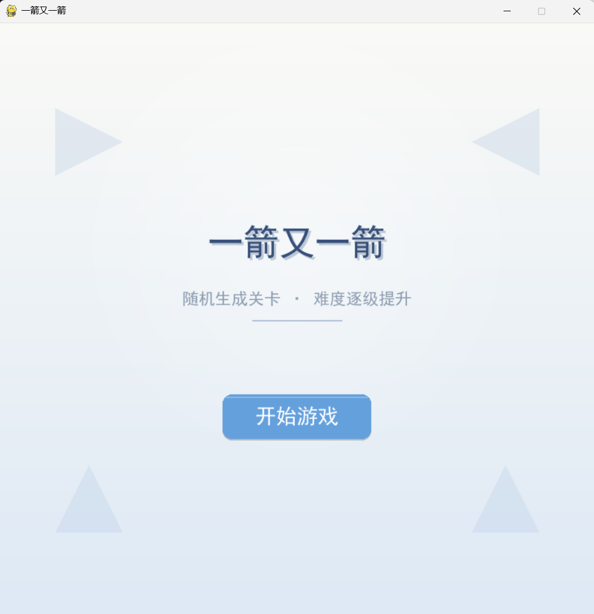
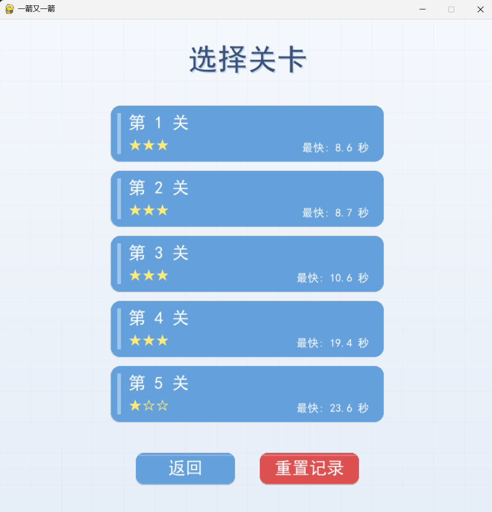
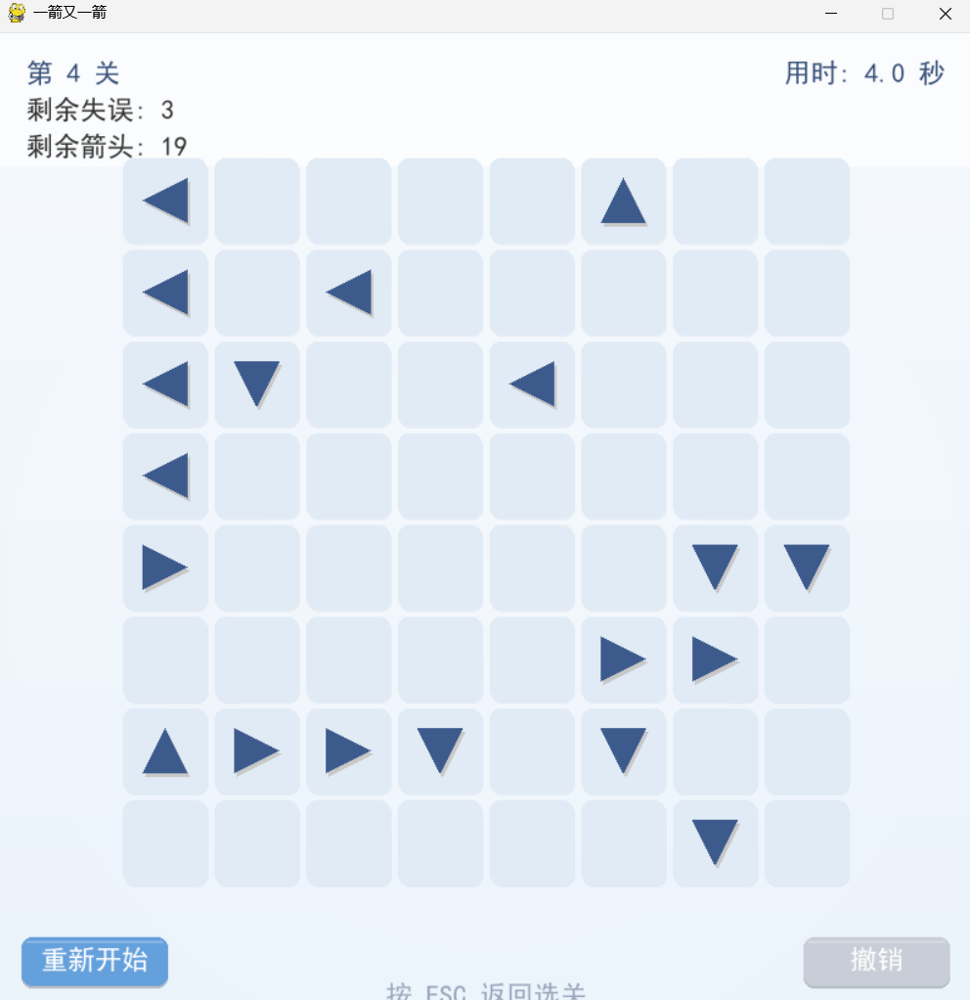
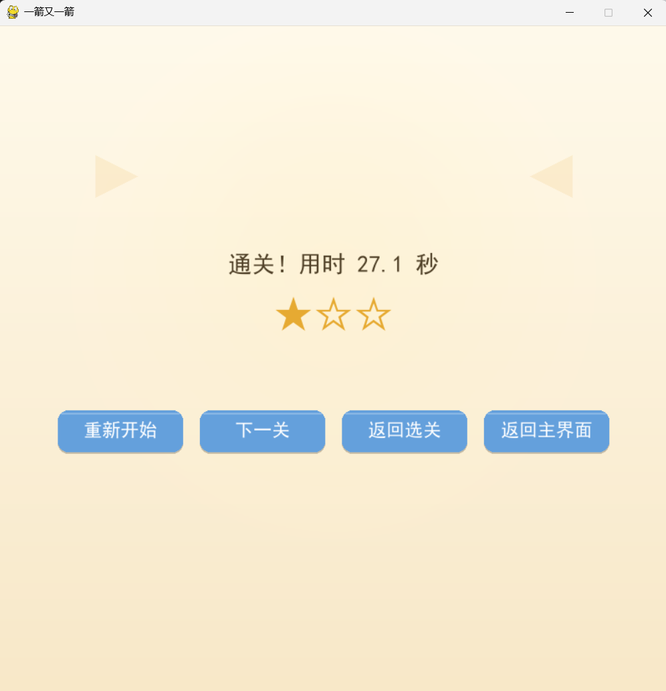
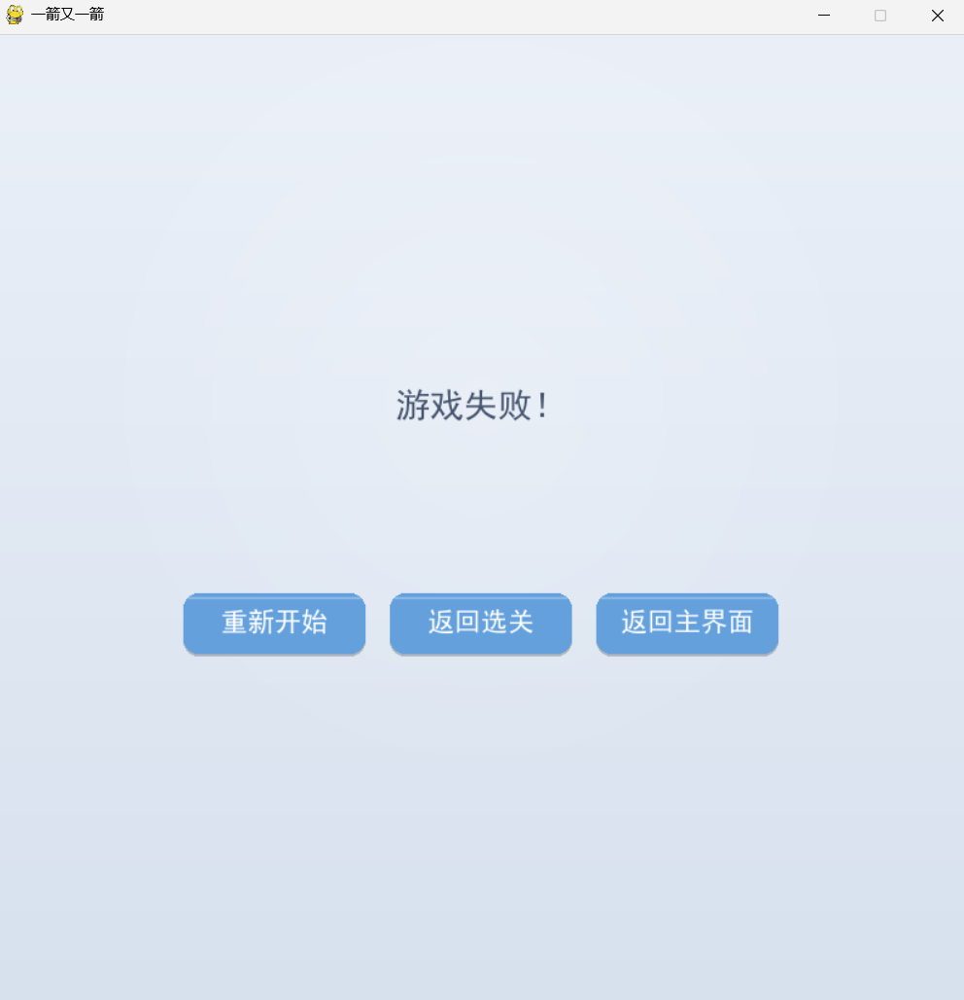

# 一箭又一箭（Arrow After Arrow）

一个使用 Python + Pygame 开发的点击式箭头解谜小游戏。

## 🎮 游戏简介

游戏棋盘中分布着若干带方向的箭头（上、下、左、右）。玩家需要观察箭头的方向和相互阻挡关系，按照正确的顺序点击箭头，使所有箭头依次飞出棋盘。

- 点击前方无阻挡的箭头 → 箭头沿方向滑出棋盘并消失；
- 点击前方有阻挡的箭头 → 箭头闪红提示，失误次数减 1；
- 失误次数耗尽 → 本关失败；
- 清空全部箭头 → 通关，根据用时和失误次数评定 1~3 星。

游戏共 **5 个关卡**，难度逐级提升，棋盘从 5×5 扩大到 9×9，箭头数量从 6-8 个增加到 21-26 个。

**所有关卡由逆向生成算法自动构造，保证 100% 有解。**

## 🖥️ 开发环境

| 项目 | 版本 |
|:---|:---|
| 操作系统 | Windows 10 / 11 |
| Python | 3.14 |
| Pygame | pygame-ce 2.5.8 |
| 编辑器 | PyCharm |
| 版本控制 | Git + GitHub |

## 📦 安装与运行

### 方式一：直接运行 exe（推荐）

进入 `dist/` 文件夹，双击 `一箭又一箭.exe` 即可运行，无需安装 Python。

### 方式二：从源码运行

1. 克隆仓库：
   ```bash
   git clone https://github.com/zhuangzhu600/arrow-game.git
   cd arrow-game
   ```

2. 安装依赖：
   ```bash
   pip install -r requirements.txt
   ```

3. 运行游戏：
   ```bash
   python main.py
   ```

## 🕹️ 操作说明

| 操作 | 说明 |
|:---|:---|
| 鼠标左键点击箭头 | 选中并尝试飞出 |
| 点击「撤销」 | 撤销上一步操作（飞出或失误） |
| 点击「重新开始」 | 当前关卡重置为初始状态 |
| 按 ESC | 游戏中返回选关界面，选关界面返回主界面 |
| 点击「重置记录」 | 清空所有存档（解锁进度、星级、最快时间） |

## 🖼️ 游戏截图

### 开始界面


### 选关界面


### 游戏界面


### 通关界面


### 失败界面


## 🗂️ 项目结构

```
arrow-game/
├── main.py                    # 程序入口，游戏主循环
├── requirements.txt           # 依赖清单
├── README.md
├── test_core.py               # 自动化测试脚本（26 个用例）
├── src/
│   ├── __init__.py
│   ├── config.py              # 常量：窗口尺寸、颜色、关卡配置
│   ├── state.py               # 全局游戏状态
│   ├── game_data.py           # Arrow 类、路径检测、逆向生成算法
│   ├── save_system.py         # 存档读写（兼容打包）
│   ├── resource_path.py       # 资源路径工具（兼容打包）
│   └── ui.py                  # 全部界面绘制逻辑
├── docs/
│   └── screenshots/           # 游戏截图
├── assets/
│   ├── images/
│   ├── sounds/
│   └── fonts/
└── dist/
    └── 一箭又一箭.exe          # 打包后的可执行文件
```

## ✨ 功能特性

- 四种方向的箭头，正确的路径检测和边界处理；
- 箭头飞出动画（沿方向滑出棋盘）；
- 碰撞反馈（闪红 + 失误扣减）；
- 撤销上一步；
- 计时与 1~3 星评级；
- 5 关难度递增（棋盘扩大、箭头增多）；
- 逆向生成算法：随机生成关卡，保证 100% 有解；
- 关卡选择界面 + 通关解锁 + 存档系统（json）；
- 最高星级与最快通关时间记录；
- 一键重置存档；
- 自动化测试脚本（26 个用例，覆盖核心逻辑）。

## 💾 存档说明

- **开发环境**：存档文件为项目根目录的 `save.json`；
- **打包后**：存档文件位于 `C:\Users\你的用户名\AppData\Roaming\ArrowGame\save.json`；
- 游戏启动时自动读取存档，通关时自动写入。

## 🧪 测试

项目包含自动化测试脚本，覆盖方向常量、路径检测、随机关卡生成、存档系统、星级评价五个模块，共 26 个用例。

运行测试：
```bash
python test_core.py
```

全部用例通过后，输出如下：
```
══════════════════════════════════════════════════════════════
          一箭又一箭  ·  核心逻辑自动化测试
══════════════════════════════════════════════════════════════
  ▎模块 A  ·  方向常量
    ✓  A01  四个方向常量的语义正确
    ...
══════════════════════════════════════════════════════════════
  ▎测试结果汇总
    总计测试     26  个
    通过          26  个
    失败          0  个
══════════════════════════════════════════════════════════════
             ✓   全部通过
══════════════════════════════════════════════════════════════
```

## 🙏 致谢

- 开发过程中使用了 **DeepSeek** 辅助需求分析、代码编写、Bug 排查与文档整理。
- 游戏玩法参考了微信小游戏《一箭又一箭》，仅参考核心玩法，未使用任何原游戏素材、代码或关卡。

## 📄 许可

本项目仅供课程学习使用。